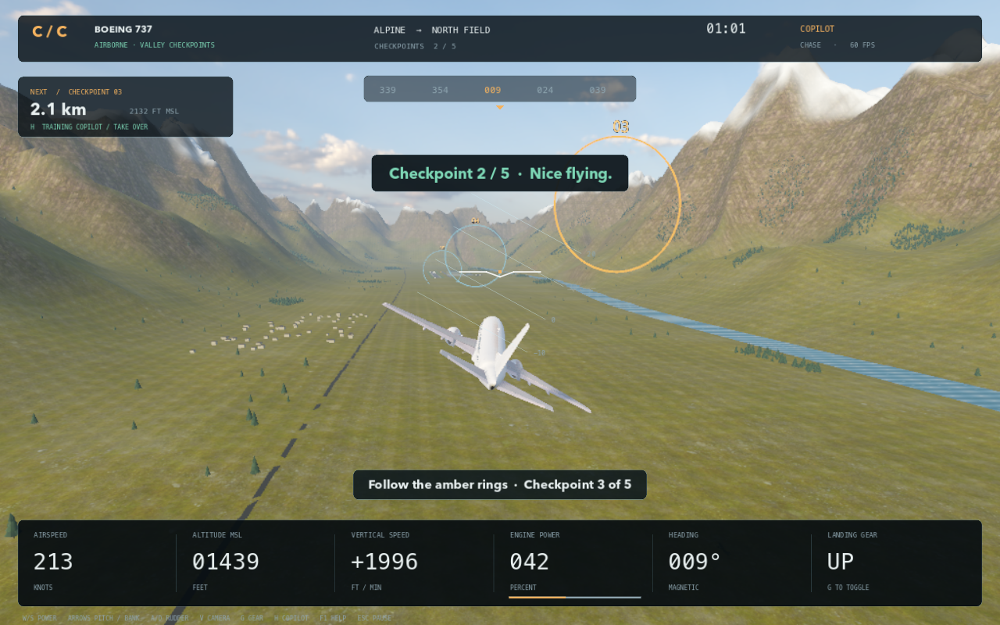

# Cardboard Cockpit

A native Mac flight game with five real aircraft models, a cinematic mountain valley, and optional cardboard controls.

**Version 0.2 — verified keyboard/mouse flight and optional vision controls.** Select an aircraft, take off from Northstar, fly through five checkpoints, and land at North Field. This is a standalone Godot application; it does not run in a browser or require an internet connection to fly.


## Play on this Mac

Double-click **Launch Cardboard Cockpit.command** in this folder, or open **build/Cardboard Cockpit.app** directly. The packaged app needs neither Godot nor Python installed. The local build is ad-hoc signed, not Apple-notarized for public distribution.

1. Choose the A380, F-35, B-2, 737, or 747 in the hangar.
2. Click **Prepare flight**, then **Cleared for takeoff**. Enter also advances these screens.
3. Hold **W** for power. At the indicated rotation speed, gently hold **↑** to lift off.
4. Follow the amber rings. Use **V** to switch between cockpit and chase views.
5. After the fifth ring, reduce power with **S**, lower gear with **G**, align with runway 36 and descend gently. Touchdown must be on the runway, below about 204 knots, with gear down and nearly level wings. Slower, gentler landings score better.

**H** engages an optional training copilot that can fly the entire route. Steering or changing power with the keyboard immediately returns control to you. Results disclose when the copilot was used. **R** restarts immediately; **Escape** pauses.

Switching to another app pauses the flight automatically. Help and camera setup block flight shortcuts until closed. Arrow-key or rudder input takes over from the mouse yoke. Missed checkpoints can be collected by turning back through the ring in either direction.

## Controls

| Input | Action |
| --- | --- |
| W / S | Increase / decrease throttle |
| ↑ / ↓ | Nose up / nose down |
| ← / → | Bank left / right |
| A / D | Rudder and ground steering |
| Space | Wheel brakes |
| G | Landing gear, including visible wheel/strut retraction |
| V | Cockpit / chase camera |
| Right mouse + drag | Look around; returns forward when released |
| B | Toggle mouse yoke; cursor displacement controls pitch/roll |
| H | Training copilot on/off |
| R | Restart from the runway |
| Escape | Pause, resume, or close the current overlay |
| F1 | Controls and credits |
| M | Mute/unmute |
| Q | Balanced/high graphics quality |
| Tab | Spectator information panel |
| C | Optional camera setup panel; calibration itself runs in tracker preview |
| 1–5 | Select aircraft in the hangar |
| Left drag / scroll | Orbit / zoom in the hangar |

## What is included

- Five externally sourced FlightGear aircraft, with original geometry, textures, source files, attribution, licenses, and reproducible conversion tools.
- A native hangar, aircraft selection, flight briefing, cockpit/chase views, live flight instruments, pause/reset/help/credits, gear control and synthesized engine audio.
- Two detailed airports with runway markings, approach lighting, terminals, hangars and control towers; a mountain corridor, river, forests, village, photographic materials and sky.
- Gradual engine power, airspeed-dependent takeoff, pitch/roll/yaw, banking turns, drag, stalls, low-altitude warnings, forgiving landing checks and a scored mission.
- Optional Python/OpenCV ArUco tracking, seven-step calibration, local WebSocket connection, smoothing, separate yoke/throttle confidence, safe tracking loss and keyboard takeover.
- Printable markers, a cardboard build guide, a spectator panel and a short demo pitch.



## Scope and known limits

This is an arcade flight prototype inspired by the presentation of larger flight simulators. It does not include global streamed scenery, real navigation databases, weather simulation, full airliner procedures, interactive aircraft-specific cockpit systems, weapons, or certified aerodynamics. All aircraft currently share a custom cockpit frame and HUD, with different exterior models and handling profiles. Gear wheels/struts hide instantly; door and control-surface animation is not implemented. Collision checks terrain and runway surfaces; airport buildings are visual scenery.

The optional tracker has passed synthetic detection and live local connection tests. **Real webcam tracking with physical cardboard props has not been validated.** The game starts in keyboard mode and never opens a webcam. The tracker opens a camera only when explicitly launched with `--camera`.

## Develop from source

The engine is pinned to **Godot 4.7.2**, standard edition. The Mac setup script downloads the official prebuilt editor into the ignored `.tools/` folder.

```sh
./tools/setup.sh
./tools/run.sh
```

For the standalone Mac app:

```sh
./tools/package_mac.sh
```

The first export downloads the official export-template archive (about 1.2 GB) and extracts its Mac template. The output is `build/Cardboard Cockpit.app`. Both Apple Silicon and Intel code are included; this build has only been exercised on Apple Silicon with Metal. The code does not require Xcode compilation.

Packaging also creates `build/Cardboard Cockpit Mac.zip`, containing the app and its source, including the original licensed aircraft files. The signature is verified before archiving outside the synced Documents folder; Finder metadata in a synced folder can otherwise interfere with strict signature checks.

Other platforms can open `simulator/project.godot` in Godot 4.7.2 and create an appropriate export preset; they have not been tested. A lower-feature renderer can be tested with `./tools/run.sh --rendering-method gl_compatibility`.

## Optional cardboard controls

Read [vision setup and calibration](docs/vision-setup.md) and the [construction guide](docs/cardboard-build-guide.md). The printed yoke uses **ArUco ID 7**, and the throttle **ID 23**, both in `DICT_4X4_50`.

Print the [one-page construction PDF](docs/Cardboard%20Cockpit%20Build%20Guide.pdf) and [marker/keyboard-panel PDF](vision/Cardboard%20Cockpit%20Markers.pdf) on A4 at **100% / actual size**. The black yoke marker is 70 mm and the throttle marker is 50 mm; both were measured and detected in the rendered PDF.

From a fresh clone, run `./tools/setup_vision.sh` to create the local `.venv` and install the pinned camera dependencies. It uses Python 3.9–3.12 or an installed `uv`. Setup never opens a camera.

```sh
# Test the native connection without a webcam:
./tools/tracker.sh --simulate --loss-demo

# When real controls are ready, explicitly choose a camera and calibrate:
./tools/tracker.sh --camera 0 --calibrate
```

In the game press **C**, enable vision, and return to flight. Calibration poses are captured with Space in the separate tracker preview. Press C in that preview to recalibrate. The client uses `ws://127.0.0.1:8765`; images are neither uploaded nor recorded.

The setup panel shows live roll, pitch, throttle and independent marker status. Closing the tracker preview stops the service and releases the camera, just like Q or Escape.

## Verification

[Verification notes](docs/verification.md) distinguish automated software checks from physical testing still outstanding.

```sh
# Run every automated check, including full keyboard AND copilot missions
# for all five aircraft. No webcam is opened:
./tools/verify.sh

# Flight behavior checks for all five profiles:
.tools/Godot.app/Contents/MacOS/Godot --headless --path simulator --script res://tests/test_flight.gd

# Full mission driven through keyboard events, copilot disabled:
.tools/Godot.app/Contents/MacOS/Godot --headless --path simulator --fixed-fps 60 --script res://tests/test_keyboard_mission.gd

# Complete-route checks for any aircraft index, 0–4:
.tools/Godot.app/Contents/MacOS/Godot --headless --path simulator --fixed-fps 60 -- --plane=0 --autotest

# Tracker and native WebSocket integration:
.venv/bin/python -m unittest discover -s vision/tests -v
.tools/Godot.app/Contents/MacOS/Godot --headless --path simulator --script ../tools/test_vision_client.gd
```

The same software suite runs in GitHub Actions on pushes and pull requests. Test logs distinguish deterministic keyboard-event input from physical OS interaction and synthetic marker images from real webcam testing.

## Files and credits

```text
simulator/          Native Godot project, UI, flight systems, scenery, models, tests
vision/             Optional tracker, calibration, printed markers and Python tests
shared/             Versioned control message contract
tools/              Setup, run, package, asset download/conversion and integration tests
docs/               Build guide, setup, verification, screenshots and planning history
build/              Local standalone app (not committed)
```

[Third-party assets](THIRD_PARTY_ASSETS.md) records aircraft authors and licensing. [Environment credits](simulator/assets/environment/README.md) records the CC0 Poly Haven materials and sky. Godot's MIT notice is bundled in the client. Original aircraft sources and their licenses remain in this repository, and should accompany redistribution of the converted models.

Repository: [excelexx/cardboard-cockpit](https://github.com/excelexx/cardboard-cockpit) (private).
