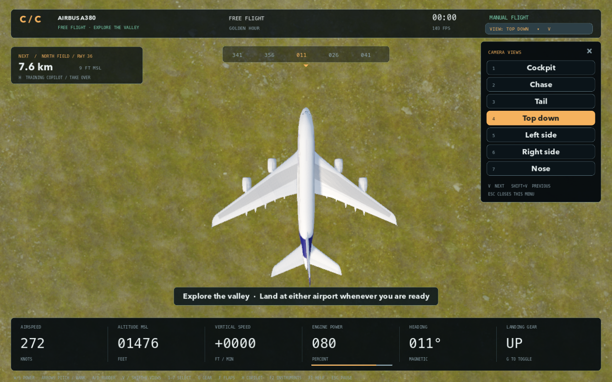

# Goose Protocol · Cardboard Cockpit

**Photographic scenery update:** the generic city grid has been replaced with 8 km² of licensed Helsinki photogrammetry, relocated into the fictional coast. Real elevation data shapes the mountains. Fir forests, scanned shoreline rocks, depth-aware water, textured airfield surfaces and retained cockpit resources improve the scenery and frame consistency. See [verification and limits](docs/GRAPHICS_PASS.md). Relaunch the source command to load it; old packaged apps are unchanged.

**Azure Coast:** coastal air station → marina → photographic city flyover → ferry harbor → suspension bridge → wooded island channel → panoramic climb → lighthouse → Cape North landing. This is a fictional arcade landscape combining photograph-derived city districts, real elevation relief and authored scenery, not a geographically accurate airport recreation.

Every flight and restart starts in the cockpit. Transparent heading/pitch references, speed/altitude tapes, a weapon reticle, blue navigation diamond and one short instruction guide beginners. V selects external views.

Eleven physical waypoints drive six weapon upgrades; progression is not on a timer. The guided regression takes approximately 185 seconds, reaches 1,041 m, visits every waypoint and ends in a full-stop landing without terrain safety corrections. High clouds frame the route without hiding the coast.

Run `tools/Review Scenic Route.command` for checkpoint captures or `tools/Review City.command` for waterfront views. See [route details](docs/SCENIC_ROUTE.md) and [coastal asset credits](simulator/assets/city/CREDITS.md). Previously packaged apps require rebuilding; close older instances and relaunch the source command.

Double-click **Launch Cardboard Cockpit.command**, then press **Enter** or **Start the full sortie**. Aim assistance fires at locked targets; **Space / left click** fires manually during combat. **Space** brakes after touchdown. **H** toggles the guided pilot. Keyboard or tracked cardboard takes control. **C** opens camera setup. The launcher prefers source when the bundled engine is present, avoiding stale packaged builds.

**Developer mode:** press **F9**, then **1–6** to jump to a weapon stage or **N** for the next stage. This changes loadout, not scenic route position. F9 disables the shortcuts again. Guided runs are assisted demonstrations, not unassisted campaign victories.

See [the three-minute judge runbook](docs/DEMO_RUNBOOK.md), [asset credits](docs/demo-assets.md), and [verification](docs/verification.md).

The six upgrades are Kestrel trainer / worn gatling, F-35 / guided missile, B-2 / heavy autocannon, An-225 / missile battery, VX-9 / pulse plasma, and Millennium Falcon-style freighter / twin plasma. Enemies always remain Canada geese; flock sizes rise from 3 to 16. No dimension switching or reality-warping systems are included.

The merged flight lab below remains accessible from **Aircraft hangar**. It preserves the upstream cockpits, weather presets and landing rollout, alongside the earlier verified fixes.

---

A native Mac flight game with six real aircraft models, a scenic fictional coastline, and optional cardboard controls.

**Version 0.3 — native keyboard/mouse flight prototype.** Choose a valley mission, landing practice, or free flight. Fly from detailed cockpits with live instruments, animated aircraft controls, selectable sky conditions, and a landing rollout. This is a standalone Godot application; it does not run in a browser or require an internet connection to fly.


## Play on this Mac

Double-click **Launch Cardboard Cockpit.command** in this folder, or open **build/Cardboard Cockpit.app** directly. The packaged app needs neither Godot nor Python installed. The local build is ad-hoc signed, not Apple-notarized for public distribution.

1. Choose the A380, F-35, B-2, 737, 747, or An-225 in the hangar.
2. Click **Prepare flight**. Choose **Valley mission**, **Landing practice**, or **Free flight**, and select **Golden hour**, **Clear midday**, or **High overcast** conditions. Start the flight. Enter also advances these screens.
3. Hold **W** for power. At the indicated rotation speed, gently hold **↑** to lift off.
4. Follow the amber rings. Use **V** to cycle camera views or click **View** at the top right.
5. After the fifth ring, reduce power with **S**, lower gear with **G**, and press **F** to select approach flaps. Follow the approach diamonds toward runway 36 at Cape North, using the aircraft's indicated speed target. Keep the wings level and descend gently.
6. After touchdown, hold **Space** to brake to a stop and use **A / D** to stay on the runway. Results appear after stopping. Landing score reflects descent rate, speed, bank and distance from the centerline; a runway overrun fails the landing.

**Landing practice** starts airborne on the Cape North approach with gear and approach flaps selected. **Free flight** removes the checkpoint requirement and lets you explore the fictional valley and land at either airport. The numbered instructions above describe the valley mission.

**H** engages an optional training copilot that can fly the route and brake after landing. Steering or changing power with the keyboard immediately returns control to you. Results disclose when the copilot was used. **R** restarts the selected flight mode; **Escape** pauses.

Switching to another app pauses the flight automatically. Help and camera setup block flight shortcuts until closed. Arrow-key or rudder input takes over from the mouse yoke. Missed checkpoints can be collected by turning back through the ring in either direction.

## Controls

| Input | Action |
| --- | --- |
| W / S | Increase / decrease throttle |
| ↑ / ↓ | Nose up / nose down |
| ← / → | Bank left / right |
| A / D | Rudder and ground steering |
| Space | Wheel brakes |
| G | Command landing gear; visible wheels/struts animate over two seconds |
| F | Cycle assisted flap settings: up / takeoff 15° / approach 30° |
| V / Shift+V | Next / previous camera view |
| 1–7 in flight | Cockpit, chase, tail, top down, left side, right side, nose |
| View menu | Click the current view at the top right to choose a camera |
| Right mouse + drag | Look around; returns forward when released |
| B | Toggle mouse yoke; cursor displacement controls pitch/roll |
| H | Training copilot on/off |
| R | Restart the selected flight mode |
| Escape | Pause, resume, or close the current overlay |
| F1 | Controls and credits |
| F2 | Compact / expanded instrument overlay |
| M | Mute/unmute |
| Q | Balanced/high graphics quality |
| Tab | Spectator information panel |
| C | Optional camera setup panel; calibration itself runs in tracker preview |
| 1–5 | Select aircraft in the hangar |
| Left drag / scroll | Orbit / zoom in the hangar |

## Camera views

Fly from the cockpit or inspect the aircraft from a chase, tail, top-down, left-side, right-side or nose camera. Press **V** to move through the views and **Shift+V** to go back. During flight, **1–7** select these views directly; in the hangar, **1–5** still select aircraft. The **View** menu is at the top right and also available while paused.

Exterior cameras adapt to each aircraft’s wingspan and length. The top-down view keeps the aircraft’s heading toward the top of the screen. Changing views preserves your flight and each restart begins in the cockpit.



## What is included

- Five externally sourced FlightGear aircraft, with original geometry, textures, source files, attribution, licenses, and reproducible conversion tools.
- A native hangar, aircraft selection, three flight modes, briefing, seven camera views, pause/reset/help/credits and synthesized engine audio.
- Original cockpit interiors tailored to the aircraft, including a panoramic fighter display, flight/navigation/engine displays, moving yokes or sticks, and throttle levers. Instruments show airspeed, altitude, attitude, heading, climb, gear, flaps and engine power.
- Animated landing gear and control surfaces, navigation lights, strobes, beacons and an F-35 exhaust effect. Original imported aircraft source geometry remains included.
- Two detailed airports with runway markings, approach lighting, terminals, hangars and control towers; a mountain corridor, river, forests, village, photographic materials and sky.
- Three visual environment presets: warm golden hour, clear midday and hazy high overcast. Selection changes sky, cloud cover, sun direction, exposure and fog; the scenery and flight model stay the same.
- Gradual engine power, airspeed-dependent takeoff, pitch/roll/yaw, banking turns, flap-assisted lift and drag, stalls, low-altitude warnings, geometric approach guidance, forgiving touchdown checks, braking rollout and landing scores.
- Terrain contact and collision with major airport buildings, including hangars, terminals, tower structures and jet bridges.
- Optional Python/OpenCV ArUco tracking, seven-step calibration, local WebSocket connection, smoothing, separate yoke/throttle confidence, safe tracking loss and keyboard takeover.
- Printable markers, a cardboard build guide, a spectator panel and a short demo pitch.


## Scope and known limits

This is an arcade flight prototype inspired by the presentation of larger flight simulators. It does not include global streamed scenery, real navigation databases, full airliner procedures, clickable aircraft-specific cockpit systems, or certified aerodynamics. The original cockpit designs are aircraft-inspired interpretations with simplified instruments, rather than faithful system replicas. Engine displays share a single simulated power state. All aircraft use the same assisted flight model with different handling profiles.

Weather presets are visual only: there is no wind, turbulence, precipitation, real weather feed or advancing day/night cycle. The approach diamonds follow a geometric three-degree path to Cape North; they are training aids, not a simulated radio navigation system. Flap angles and their handling effects are generic training settings. Gear folding and control-surface motion are approximate visual animations; touchdown checks use the commanded gear state rather than a full hydraulic or gear-lock simulation.

Collision uses the rendered terrain and simple bounds for major airport buildings. Trees, poles and small furniture remain forgiving, and aircraft-wide wing collision is not modeled. Landing limits are deliberately generous and do not represent real operating speeds or limits for these aircraft. Free flight remains within the same bounded fictional coast.

The optional tracker has passed synthetic detection and live local connection tests. **Real webcam tracking with physical cardboard props has not been validated.** The game starts in keyboard mode and never opens a webcam. The tracker opens a camera only when explicitly launched with `--camera`.

## Develop from source

The engine is pinned to **Godot 4.7.2**, standard edition. The Mac setup script downloads the official prebuilt editor into the ignored `.tools/` folder.

```sh
./tools/setup.sh
./tools/run.sh
```

For the standalone Mac app:

```sh
./tools/package_mac.sh
```

The first export downloads the official export-template archive (about 1.2 GB) and extracts its Mac template. The output is `build/Cardboard Cockpit.app`. Both Apple Silicon and Intel code are included; this build has only been exercised on Apple Silicon with Metal. The code does not require Xcode compilation.

Packaging also creates `build/Cardboard Cockpit Mac.zip`, containing the app and its source, including the original licensed aircraft files. The signature is verified before archiving outside the synced Documents folder; Finder metadata in a synced folder can otherwise interfere with strict signature checks.

Other platforms can open `simulator/project.godot` in Godot 4.7.2 and create an appropriate export preset; they have not been tested. A lower-feature renderer can be tested with `./tools/run.sh --rendering-method gl_compatibility`.

## Optional cardboard controls

Read [vision setup and calibration](docs/vision-setup.md) and the [construction guide](docs/cardboard-build-guide.md). The printed yoke uses **ArUco ID 7**, and the throttle **ID 23**, both in `DICT_4X4_50`.

Print the [one-page construction PDF](docs/Cardboard%20Cockpit%20Build%20Guide.pdf) and [marker/keyboard-panel PDF](vision/Cardboard%20Cockpit%20Markers.pdf) on A4 at **100% / actual size**. The black yoke marker is 70 mm and the throttle marker is 50 mm; both were measured and detected in the rendered PDF.

From a fresh clone, run `./tools/setup_vision.sh` to create the local `.venv` and install the pinned camera dependencies. It uses Python 3.9–3.12 or an installed `uv`. Setup never opens a camera.

```sh
# Test the native connection without a webcam:
./tools/tracker.sh --simulate --loss-demo

# When real controls are ready, explicitly choose a camera and calibrate:
./tools/tracker.sh --camera 0 --calibrate
```

In the game press **C**, enable vision, and return to flight. Calibration poses are captured with Space in the separate tracker preview. Press C in that preview to recalibrate. The client uses `ws://127.0.0.1:8765`; images are neither uploaded nor recorded.

The setup panel shows live roll, pitch, throttle and independent marker status. Closing the tracker preview stops the service and releases the camera, just like Q or Escape.

## Verification

[Verification notes](docs/verification.md) distinguish automated software checks from physical testing still outstanding.

```sh
# Run every automated check, including full keyboard AND copilot missions
# for all five aircraft. No webcam is opened:
./tools/verify.sh

# Flight behavior checks for all five profiles:
.tools/Godot.app/Contents/MacOS/Godot --headless --path simulator --script res://tests/test_flight.gd

# Weather, rendered terrain contact, and airport building collision:
.tools/Godot.app/Contents/MacOS/Godot --headless --path simulator --script res://tests/test_weather.gd

# Aircraft animations, reset and imported-geometry preservation:
.tools/Godot.app/Contents/MacOS/Godot --headless --path simulator --script res://tests/test_aircraft_visuals.gd

# Camera framing, keyboard selection and flight-state preservation:
.tools/Godot.app/Contents/MacOS/Godot --headless --path simulator --script res://tests/test_camera.gd

# Landing, flaps, runway rollout and approach guidance:
.tools/Godot.app/Contents/MacOS/Godot --headless --path simulator --script res://tests/test_landing.gd

# Full mission driven through keyboard events, copilot disabled:
.tools/Godot.app/Contents/MacOS/Godot --headless --path simulator --fixed-fps 60 --script res://tests/test_keyboard_mission.gd

# Complete-route checks for any aircraft index, 0–4:
.tools/Godot.app/Contents/MacOS/Godot --headless --path simulator --fixed-fps 60 -- --plane=0 --autotest

# Tracker and native WebSocket integration:
.venv/bin/python -m unittest discover -s vision/tests -v
.tools/Godot.app/Contents/MacOS/Godot --headless --path simulator --script ../tools/test_vision_client.gd
```

The same software suite runs in GitHub Actions on pushes and pull requests. Test logs distinguish deterministic keyboard-event input from physical OS interaction and synthetic marker images from real webcam testing.

## Files and credits

```text
simulator/          Native Godot project, UI, flight systems, scenery, models, tests
vision/             Optional tracker, calibration, printed markers and Python tests
shared/             Versioned control message contract
tools/              Setup, run, package, asset download/conversion and integration tests
docs/               Build guide, setup, verification, screenshots and planning history
build/              Local standalone app (not committed)
```

[Third-party assets](THIRD_PARTY_ASSETS.md) records aircraft authors and licensing. [Environment credits](simulator/assets/environment/README.md) records the CC0 Poly Haven materials and sky. Godot's MIT notice is bundled in the client. Original aircraft sources and their licenses remain in this repository, and should accompany redistribution of the converted models.

Repository: [excelexx/cardboard-cockpit](https://github.com/excelexx/cardboard-cockpit) (private).
