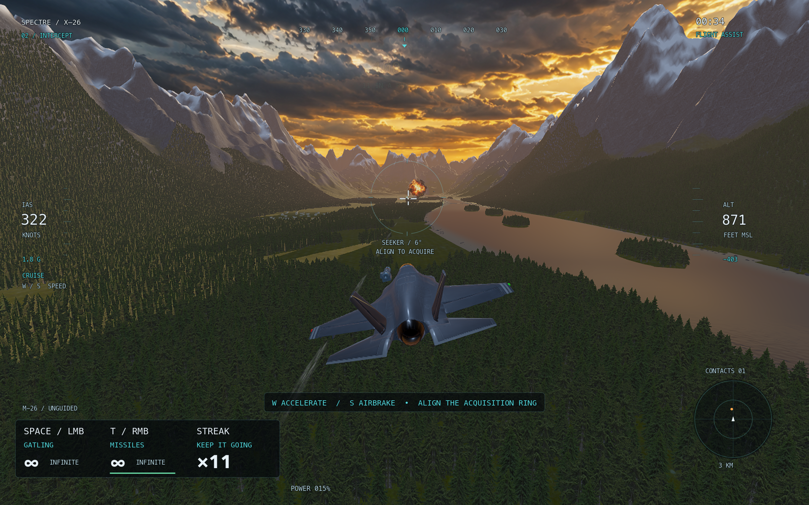

# Goose Protocol — SPECTRE X-26

Version 0.10.1 is a relaxed native Mac arcade flight game: **one SPECTRE fighter, unlimited Gatling fire and guided missiles, and large Waterloo geese to intercept over San Francisco Bay**. The geese do not attack. There are no upgrades, reloads, heat limits or steady-lock requirements.

Open **Launch Cardboard Cockpit.command** or **build/Cardboard Cockpit.app**. Choose **Play** (or Enter): flight assistance handles takeoff and the route so you can concentrate on shooting. Hold **Space + T**, or both mouse buttons, to fire both weapons together. **Watch demo** runs the entire takeoff → interception → landing sequence automatically. The default **Azure Coast** tour takes about three minutes; the preserved **Alpine Valley** sortie takes about 2 minutes 18 seconds. The ROUTE button switches between them.



## Fly

| Input | Action |
| --- | --- |
| Arrow keys | Smooth bank / pitch; release to level |
| A / D | Rudder; steer during rollout |
| W / S | Fast acceleration / airbrake |
| Hold Shift | Afterburner |
| Hold Space / left mouse | Unlimited Gatling fire; Space brakes on the ground |
| Hold T / right mouse | Unlimited missiles; narrow seeker lock or straight unguided flight |
| Z | Optional flare effects |
| Q | Quick barrel roll, when altitude permits |
| V | Cockpit / chase camera |
| X | Toggle missile datalink inset |
| Alt + mouse / middle drag | Look around |
| G / F | Gear / flap detent |
| B / J | Mouse yoke / close-range aim assistance |
| H | Route flight assistance on/off |
| Hold E | Eject |
| C / F1 | Cardboard setup / controls |
| Escape / R / M | Pause / restart / mute |
| F9 / F10 | Telemetry / graphics quality |

Bring a goose inside the small six-degree acquisition ring. The crosshair smoothly tracks it, a brief amber acquisition turns green, and the HUD shows track ID, range, lock and missile readiness. A 7.5-degree retention margin tolerates small drift. Only the locked target receives missile guidance; unlocked missiles fly straight and still ignite normally. A separate small lead diamond shows the gun solution. Geese arrive individually, 1.8 seconds apart with longer pauses between groups, and at most four are active. Retiring contacts leave without an abrupt replacement swarm. Markers, projectiles, trails and impact effects keep the action readable. Clears within five seconds build a streak and increase points. Personal best scores are saved for player-controlled shooting runs; Watch demo does not set your record.

Hold W for immediate acceleration and S for a strong airbrake, with a forgiving 80 m/s minimum while airborne with gear up. The HUD shows ACCEL, AIRBRAKE and CRUISE. Keyboard steering or power input takes over from route assistance. The manual controller maps inputs to a controlled bank or pitch angle; releasing settles the aircraft toward level flight. A gentle terrain guard pulls up through the physics model when needed. H rejoins the guided route. Switching applications pauses flight, and help/setup overlays freeze the simulation.

Landing practice starts on final with gear and flaps selected. With neutral pitch input, landing assistance follows the descent and flare; neutral power input uses approach-speed assistance. After touchdown, Space brakes and A/D steers. The complete assisted sortie lands and brakes automatically. Touchdown preserves position and attitude and settles through a physical rollout.

## Scenery and presentation

Festyve’s `graphics/coastal-overhaul` is integrated: offline Helsinki photogrammetry, 128 base tiles with 256 detailed refinements, 60 Kominka countryside homes, a maritime air station, grounded airports, shoreline scenery and an eleven-landmark coastal tour. The cockpit improvements and instrument batching are retained. Blue navigation diamonds lead through the city and islands; our SPECTRE, permanent weapons, infinite ammunition and harmless geese are shared by both routes. The existing alpine environment remains selectable. [Coastal credits](simulator/assets/photogrammetry/CREDITS.md) · [Scenic route](docs/SCENIC_ROUTE.md).

The active balance uses developer-published Sky Rogue references with documented metric-scale and difficulty adaptations. [Balance values and provenance](docs/balance.md) distinguish source values from our calibration.

## Presentation and handling

SPECTRE refines a licensed FlightGear airframe with a clean graphite livery, corrected hardpoint/exhaust placement, reflective canopy, animated control surfaces, folding gear and weapon-bay doors. The M-26 missile is an original Blender model with beveled fins, a ceramic seeker, collars, nozzle and service details. Its editable source is in `docs/source/M26.blend`; `tools/build_m26_blender.py` rebuilds the GLB using Blender 4.5.

Cannon rounds inherit aircraft velocity and include gravity, drag and swept collision checks. Missiles separate before motor ignition, accelerate, follow curved guidance paths toward their original locked target and burn out. Their visual size is deliberately exaggerated for readability. Ammunition is unlimited; external stores replenish as a presentation effect.

The valley uses generated sunset-cloud, conifer, granite and explosion textures alongside the licensed environment sources. Tall varied forests, lake islands, wet shoreline boulders, reflective rippled water, cloud/mist volumes, shadows and ambient occlusion build depth. Wing vapor, wind streaks, trails, heat distortion and correctly positioned afterburner exhaust respond to flight. The sky and lighting follow the title artwork's warm/cool palette; this remains a real-time game environment rather than a reproduction of every detail in that generated still.

High quality is the default. F10 selects Balanced. Internal 3D resolution is budgeted to 1600 pixels wide in High and 1280 in Balanced, with spatial upscaling; the HUD stays at window resolution. This keeps large Retina windows responsive. High uses temporal antialiasing to reduce foliage shimmer.

Audio combines licensed engine, wind, weapon, impact, gear and tire sounds with cockpit ambience and music. Radio cues use filtering, priority/expiry, subtitles and ducking; these are Kenney recordings, not ElevenLabs generations. Escalating confirmation tones and streak feedback reinforce successful clears.

## Cardboard controls

Use [vision setup](docs/vision-setup.md) and the [construction guide](docs/cardboard-build-guide.md). Print the [build-guide PDF](docs/Cardboard%20Cockpit%20Build%20Guide.pdf) and [markers PDF](vision/Cardboard%20Cockpit%20Markers.pdf) at **100% / actual size**. The yoke uses ArUco ID 7 (70 mm), throttle ID 23 (50 mm), dictionary `DICT_4X4_50`.

```sh
./tools/setup_vision.sh
./tools/tracker.sh --simulate --loss-demo
# Explicitly open a webcam and calibrate when the props are ready:
./tools/tracker.sh --camera 0 --calibrate
```

Press C in the game and enable tracking. Capture the seven calibration poses in the separate tracker preview. The service stays on `127.0.0.1`; images are not uploaded or recorded. The native game works without Python or a camera. Physical cardboard/webcam operation remains unverified; synthetic tracking and the live local connection are tested.

## Develop and verify

The project pins Godot 4.7.2. Mac exports include Apple Silicon and Intel binaries; runtime verification is on Apple Silicon with Metal.

```sh
./tools/setup.sh
./tools/run.sh
./tools/verify.sh
./tools/package_mac.sh
```

Packaging creates `build/Cardboard Cockpit.app` and `build/Cardboard Cockpit Mac.zip`, including source and asset notices. The build is locally signed and is not Apple-notarized. See [verification](docs/verification.md), [demo runbook](docs/DEMO_RUNBOOK.md), and [asset credits](docs/demo-assets.md).

This remains a compact, game-tuned flight project. It does not provide certified aerodynamics, global scenery, a clickable avionics simulation or commercial AAA production assets. Terrain and major buildings collide; trees and small scenery are forgiving. Historical licensed aircraft files remain as source provenance and are excluded from the playable export. Large geese, generous aim assistance and unlimited weapons are intentional arcade choices.

## San Francisco world

The default map is now a complete sourced San Francisco regional tile with the city, SFO, Golden Gate Bridge, Bay Bridge, Alcatraz, terrain, roads and residential neighborhoods. Its continuous SFO round trip takes about eight minutes. The route selector also retains the two legacy maps. See [coverage, licenses and conversion details](docs/san-francisco.md).
