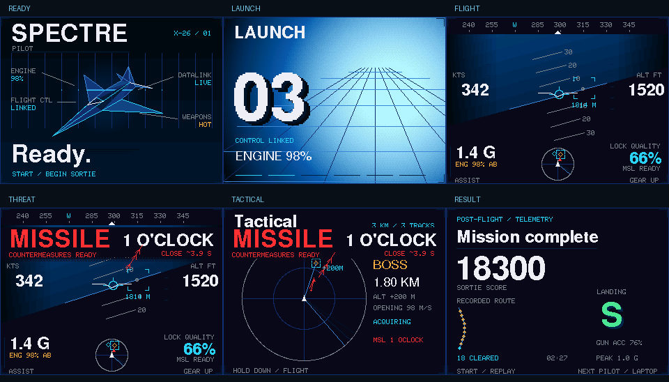

# SPECTRE badge: cinematic instrument design

The 320×240 display uses a projected, shaded fighter on Ready; a three-second engine-spool/countdown sequence; a spatial flight HUD; dominant directional threat overlays; an expanded tactical view; and an animated telemetry debrief. The six LEDs and laptop cues follow actual launch, lock, firing, threat and result events. Tilt controls remain disabled.

Primary states use proportional FreeSans display fonts. Small metadata keeps a compact mono face. Background light, sparse gradients, projected geometry, measured text alignment and animated bearing chevrons provide depth without decorative panel frames. The dark perimeter stays continuous.

## Controls and data

Hold DOWN for 0.65 seconds to switch between flight and tactical views. A short press toggles the laptop text HUD on release. Launch holds the native demo simulation while the engine ramps from zero to full; then normal flight resumes. Headless verification does not wait for the cinematic.

Engine output, afterburner, G-load, actual flight-path velocity, the game’s targeting solution, relative contact velocities/altitudes, weapon readiness, score, accuracy, flight duration and landing quality come from game state. Debrief traces sample actual world positions; amber markers indicate increases in cleared contacts. Closing estimates assume current relative motion and are labelled approximate. No heat, fuel, geography or encryption state is invented.

## Design collaboration and verification

Two isolated Kimi CLI sessions implemented layout/typography and the portable motion module. A further Kimi image review reported no definite clipping, overlap or contrast issues. Codex integrated the code, corrected palette-range discontinuities and overflow edge cases, kept the horizon continuous, and moved bloom division out of the per-pixel loop.

The firmware is compiled offline. Cross-language tests exercise the actual C++ packet receiver against Python frames, and native motion tests run under an undefined-behavior sanitizer. See [build and acceptance status](../hardware/badge-controller/evidence/cinematic-build.json). Final flashing, device checks and the live demonstration are held until the user explicitly gives the go-ahead for the team showing.
