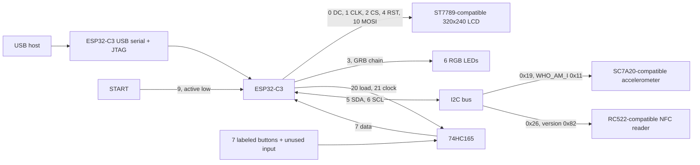

# Hardware map

## Identification and evidence

The USB device enumerated as Espressif `303a:1001`, product `USB JTAG/serial debug unit`, with CDC control/data and a vendor JTAG interface. `esptool` identified **ESP32-C3 QFN32 revision 0.4**, 40 MHz crystal, Wi-Fi/BLE, and embedded 4 MB flash reported as XMC. The flash-ID transaction reported manufacturer `0x46`, device `0x4016`. The observed USB link was full speed, 12 Mbit/s.

The eight labels, color display, badge provisioning structure, and maker's front/back photographs match the **Hack the North 2026 Hacker Badge**. The user transcribed the display flex marking as `HS30HS072RX`; the exact panel supplier/part suffix was not independently established. The retained firmware uses the ST7789 driver and a 320×240 LVGL display. A matching command sequence produced visible bands on the physical screen.

The current Arduino application is not the original graphical badge firmware. Its banner is `=== 74HC165 pin finder ===`. Older executable segments remained in flash and supplied the original board initialization routines.

## Complete GPIO allocation for this investigation

| ESP32-C3 GPIO | Board role | Direction / interface | Evidence |
|---:|---|---|---|
| 0 | LCD data/command | Output: low command, high data | Retained initialization + visible output |
| 1 | LCD clock | SPI clock, mode 0 sequence | Retained initialization + visible output |
| 2 | LCD chip select | Active low output | Retained initialization + visible output |
| 3 | Six RGB LED data chain | GRB, 800 kHz-class one-wire | Green output on this pin confirmed by user |
| 4 | LCD reset | Active low output | Retained initialization + visible output |
| 5 | Shared I²C SDA | Open drain, pulled up | Retained initialization + ACK/read/write tests |
| 6 | Shared I²C SCL | Open drain, pulled up | Retained initialization + ACK/read/write tests |
| 7 | 74HC165 Q7 | Serial input, MSB first | Retained read routine + all-button calibration |
| 8 | Unassigned here; strap | Leave alone | Not established as an application signal; blue LED hypothesis failed |
| 9 | START / boot strap | Active-low input | Physical START capture + ESP32-C3 boot behavior |
| 10 | LCD MOSI | SPI output | Retained initialization + visible output |
| 11 | VDD_SPI / reserved | Not available for this tool | ESP32-C3 chip/package constraints |
| 12–17 | Flash-related/internal | Not available for this tool | Embedded flash / SoC pin allocation |
| 18 | USB D− | Dedicated active USB connection | Espressif USB/JTAG documentation |
| 19 | USB D+ | Dedicated active USB connection | Espressif USB/JTAG documentation |
| 20 | 74HC165 parallel load | Active low output | Retained routine uses literal decimal 20 |
| 21 | 74HC165 shift clock | Rising-edge clock | Retained routine uses literal decimal 21 |

These are **chip GPIO numbers**, not package pin numbers, connector pad numbers, or Arduino aliases such as `D3`. External JTAG functions commonly associated with GPIO4–7 are not the debug path used here; those pins already serve the badge peripherals. The built-in USB JTAG interface needs no external probe.

## What is not established by this map

No schematic/BOM or electrical continuity measurements were available. The precise RGB LED package, NFC silicon manufacturer, regulator/charger part numbers, NFC antenna tuning, current consumption, and unused test-pad connections were not measured. GPIO8 should not be assigned a function by elimination. A separate LCD backlight control pin was not recovered; the visible test did not require one.

The board's 3.3 V GPIO domain is not a 5 V control interface. USB-C is the connector shape; the observed controller is USB 2.0 full speed with fixed serial/JTAG functions. See [subsystems](subsystems.md) for power and USB constraints.
